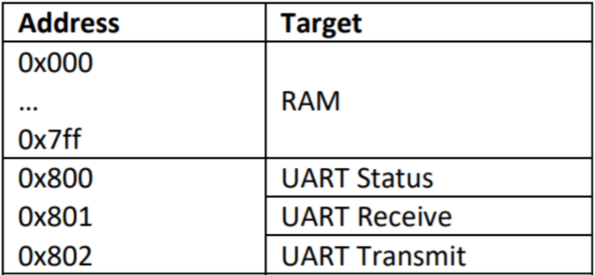
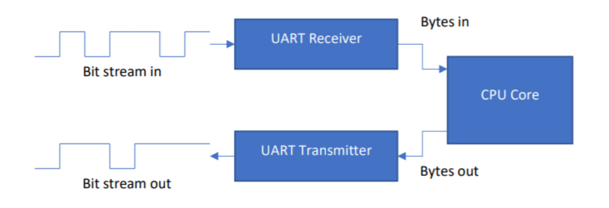
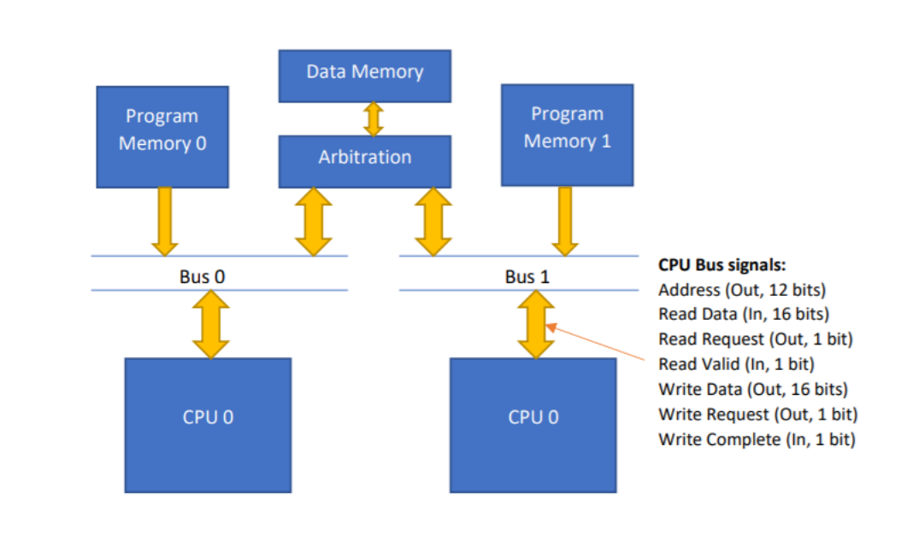

# Computer Architecture Design Project: DualCore ARM CPU 
## introduction
ARM-CPU is initially part of a one-year module focused on Digital Design and Computer Architecture, and it is later extended into a group project. The CPU was implemented using Issie. [Issie](https://github.com/tomcl/issie) is an application for digital circuit design and simulation, which enable the development of digital circuit at logic gate level.  

The objective of this project was to build an efficient CPU using the ARM architecture, optimized to solve commonly occurring computing problems. As the CPU was designed at logic gate level, the feature had to be chosen carefully to achieve the best performance in the greatest number of applications for the smallest number of transistors.

This README aim to give a high level overview of the cpu implementation, for more details you can access refer to the full [report](https://github.com/lou296A/Arm-CPU/blob/master/Pictures/CPU_Project_Report_-_Patsalidis%2C_Mohd_Ridzal%2C_Alsteens.pdf).Bare in mind that this was one of my first report as student (Fortunetely the quality of my reports have improved over time).   

### Specification	
- 16 bits Word CPU
- Support basic operation: add, subtract and multiplication, shifting, XOR, AND, MOV
- 16 and 32-bit Floating point arithmetic 
- Pipelined
- Serial communication using UART for network communication and storage. 
- Dual-core 

These were successfully developed and can be seen within the repository.

## UART
Serial communication is our initial focus. To achieve this, a UART (universal asynchronous receiver transmitter) is being designed to act as a memory-mapped device. 
This enables the CPU to manage byte transmission and reception through special registers, data can then be store in the regular RAM locations.

The UART block should include two sub-blocks, each handling the reception or transmission of a 10-bit word.
The word to be received/transmitted should consist of 1 start bit (logic 0), 1 stop bit (logic 1), and 8 data bits. 
The least significant bit (LSB) of the byte is the first to be received/transmitted

For this UART implementation:

- Data is transmitted and received sequentially at a rate of 1 bit per 4 clock cycles.
- CPU recognition features include:
	- Detection of received bytes since the last CPU read of the receive register.
	- Identification of ongoing transmissions.
 	- Handling of receive overflow (when a byte arrives before the previous one is read).
	- Handling of transmit overflow (when a byte is written by the CPU before the previous byte finishes transmission).
	- Add a interupt function so data can be received at random point in time.
 More information on those specification can be found in the report. 

## Dual Core CPU
The Dual Core CPU is the second feature that was implemented, and it requires the design of a mechanism for two CPU cores to share data while maintaining separate instruction memory.
Problems may arise from sharing data, such as when both CPUs try to access the data
memory simultaneously. To counteract this problem, we will be including an arbitration logic
in our design, which will grant access to the data memory to a specific CPU and force the
other CPU to stall and access the data in the next clock cycle.

With the aid of the various Bus signals shown in the figure above, the arbitration logic will be
able to recognise when a read or write operation is taking place/has been completed.
The addition of this feature, will allow us to execute something twice as fast since we can now
split the workload into two CPUs, working simultaneously
#overall archicte

## Floating-Point Arithmetic

Arithmetic is vital part of a CPU and is therefore greatly advantageous to be able to improve
that aspect of our CPU, by implementing Floating-Point Arithmetic. It will allow us to
represent numbers with more accuracy, and thus be able to have more precise calculation
results.
This feature needs to support Addition, Subtraction and Multiplication. Each operation requires
a different way of handling, and consequently three different designs should be created (more info can be found in the [report](https://github.com/lou296A/Arm-CPU/blob/master/Pictures/CPU_Project_Report_-_Patsalidis%2C_Mohd_Ridzal%2C_Alsteens.pdf)

For our implementation, we shall be using the 16-bit IEEE 754 half-precision number format.
The 16-bit word which we will be using to represent our numbers, should include 1 sign bit, 11
significant bits and 5 exponent bits

We are also designing the advanced segment of the Floating-Point Arithmetic feature, which
uses 32-bit IEEE 754 single precision number format. In contrast to the previous number
representation, for this one we use 1 sign bit, 23 significant bits and 8 exponent bits. Both
number formats will be explained in more detail later

	
	
